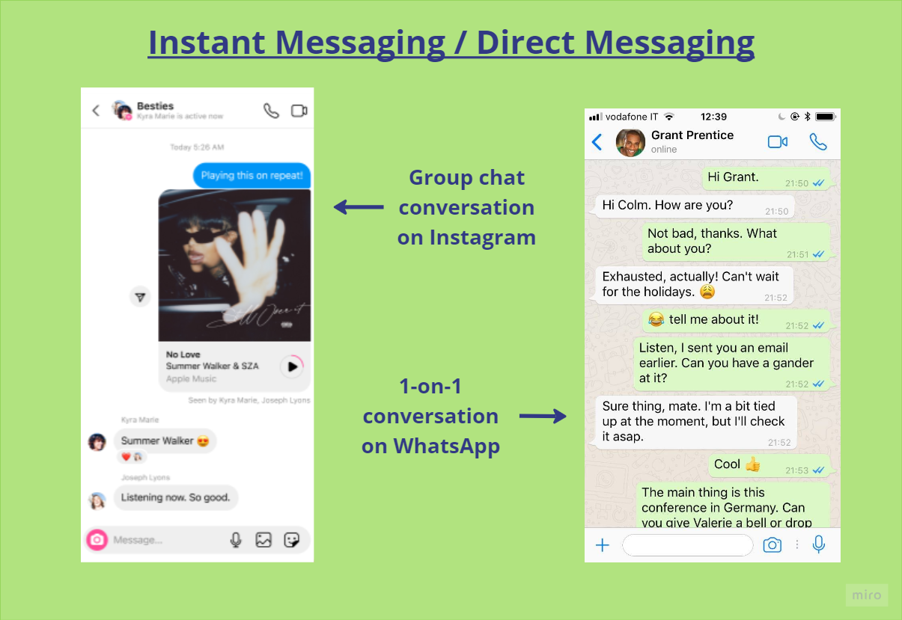

Section 1.3

# Direct Messaging

**Direct messaging** (also known as DM-ing) or **instant messaging** is very similar to texting. However, it is always done over the internet, not over a cellular network. This just means the messages use a different method than texts do to get from one device to another. The technical details are not necessary to understand in order to use this communication method.

iPhones (phones made by the company Apple), have a built-in instant-messaging feature called iMessage. Many social media apps also have instant-messaging features.

Another example is WhatsApp, which is a popular instant-messaging app that people often use to send messages internationally.

You may be wondering, why would you need another way to send messages to people? Isn’t texting enough? Direct messages have a few benefits over texting:

- **Avoid long-distance charges:** Sending texts over a cellular network to people in other countries will often cost you money. This is called long-distance texting. Direct message are a great alternative because sending messages over the internet is usually free.
- **Use any device:** Only phones can send texts. Direct messages can be sent by many types of devices such as phones, laptops, and tablets.
- **Avoid exchanging numbers:** You need someone's phone number to send them a text, but you don’t always need it to send them an instant/direct message. Some people don’t want to give their phone number to people they don’t know well and would prefer to communicate through DMs.

<figure markdown="span">
    { width="100%" }
</figure>
Image sources (left to right): `https://about.instagram.com/blog/announcements/introducing-new-dm-features
https://www.facebook.com/BigBusinessEnglish/photos/a.573630213019972/629393754110284/?type=3`

Above are some examples of what direct/instant messaging can look like on Instagram and WhatsApp.
