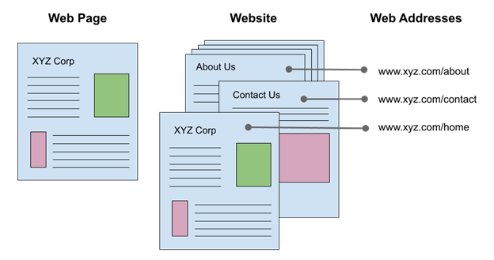
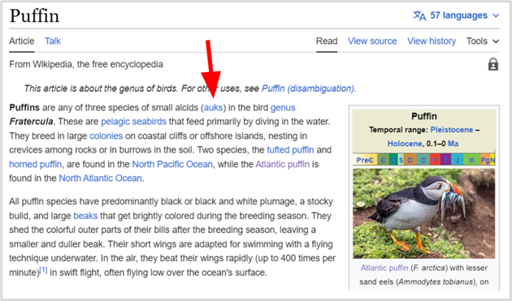

# Navigating Websites

Once you have connected to the internet, you gain access to websites! However, before you can use a web browser to access websites, which you will learn in 6.3 Browsers and Search Engines, it is a good idea to understand the concepts of web pages, websites, and web addresses.

## What are web pages, websites, and web addresses?

A **web page** is a page of information that you access using the internet. It can include text, images, buttons, videos, and other types of content. Each web page has a unique address given to it. This is called a **web address** or a **URL** (Uniform Resource Locator.) Sometimes a web page is just called a page for short.

A **website**, or **site** for short, is a collection of interlinked web pages that share a domain name (you can think of the domain name as just the name of the website.) For instance, a company called XYZ Corporation might have a Home page, an About Us page, a Contact Us page, and many other pages, all on the same website. Each page’s address might look something like this: xyz.com/home, xyz.com/about, and xyz.com/contact. The common domain name between these is xyz.com. This is summarized in the diagram below.

<figure markdown="span">
    { width="80%" }
</figure>

## What are links?

A hyperlink, or link for short, is a piece of text or a button that you click to lead you to something else. Often this ‘something else’ is a web page, or a specific section of a web page. Behind the scenes, the link has an address, and clicking it will take you to the web page at that address.

Link is also used as an action word. Saying “page 1 links to page 2” is the same thing as saying “page 1 contains a link to page 2.”

Links are often formatted as blue or purple underlined text. Blue links lead to web pages you have not been to before. Purple links lead to web pages you have previously visited. Sometimes links are formatted as buttons like these ones:

<figure markdown="span">
    { width="50px" display="inline" }
</figure>
<figure markdown="span">
    { width="50px" display="inline" }
</figure>
These examples don’t actually lead to anything when you click them, so they are not true links. They are just meant to show what links look like visually.

As an example, say you are reading about puffins on the web page with this address: en.wikipedia.org/wiki/Puffin. This web page is shown in the image below. Each piece of blue text is a link to another web page.

<figure markdown="span">
    { width="100%" }
</figure>

One of the first links on this page is the word auks, which we have pointed to with a red arrow. If you click on this word, you will be taken to the address en.wikipedia.org/wiki/Auk. As you can see in the image below, the web page about puffins is replaced with one about auks.

<figure markdown="span">
    { width="100%" }
</figure>

This web page also has many links. One of them leads back to the page we were just on–the one about puffins. This link is purple instead of blue because we have already been to the web page it links to.

Earlier, we said that a website is a collection of interlinked web pages. "Interlinked" means that the web pages that make up a website like Wikipedia contain links to each other, so you can easily navigate from one page to another.
