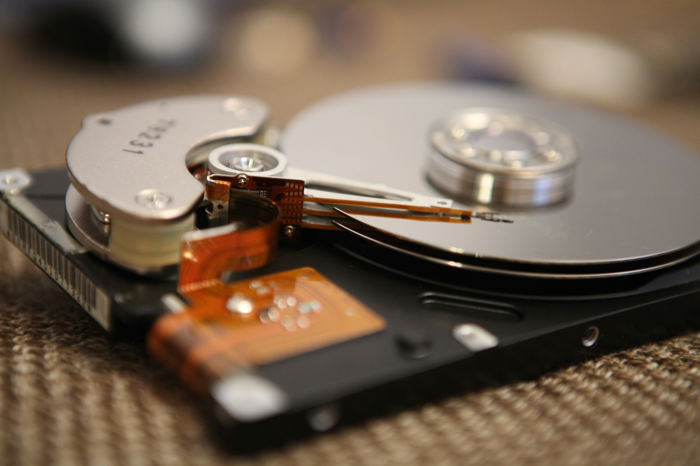

Unit 3 | Staying Safe

# Encryption

You might see the word 'encryption' come up, such as when a program says that it is going to 'encrypt' your data. What does this mean?

Encryption is like locking something in a box. No one can open that box, or even see inside it, unless they know the right password. This box can contain anything, like a message, a picture, a document, etc.

If you see that encryption is happening, this is usually a good sign. Your information is being kept locked up and secure. Just be sure to remember your password because it will be very difficult to open this box. It is usually impossible to open this box without the password.

??? extra-info "How does encryption work?"

    Firstly, **how is information stored in the digital world?**

    When you want to write down some information on paper, you use ink to draw letters. A computer does something similar. Inside the computer there is a physical object, and the computer will write down information on this object. This object might be called a "hard drive", "drive" or "disk".

    <figure markdown="span">
        { width="300" }
        <figcaption>A photo of a 'hard drive'</figcaption>
    </figure>

    ### **What can happen to this information?**

    If someone had the right tools, they could open up your computer and take out this object. Then could then look very carefully at this object to see what information is written on it. This is like someone taking your notebook and reading what you wrote.

    ### **How does encryption help?**

    Encryption is a technique used by computers to store the information in a secret language that it makes up itself.

    - Instead of writing down `My name is Joe`, the computer will make up a secret language and write down the information using that.
    - If someone looked carefully at the information, it wouldn’t make any sense. They might see something like `My UIA2PW8M is XYKS4DGT5P82LW`.
    - Later on, when you want to get that information again, the computer will ask you for the password. If you can give the right password, the computer will translate the secret language back into the original information.

   
