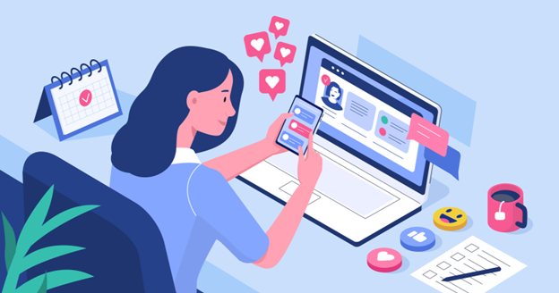
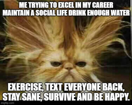
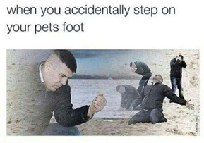
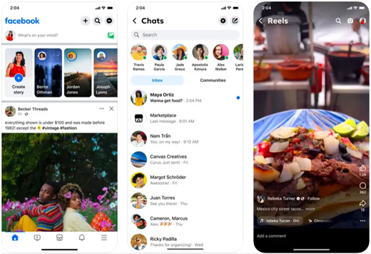
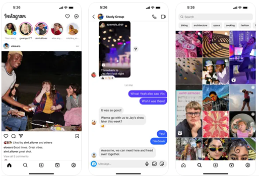
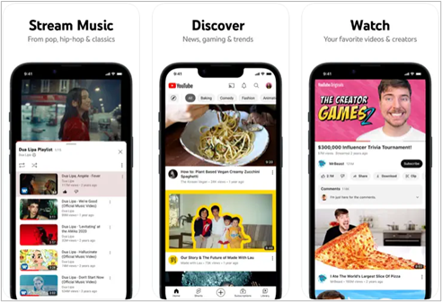
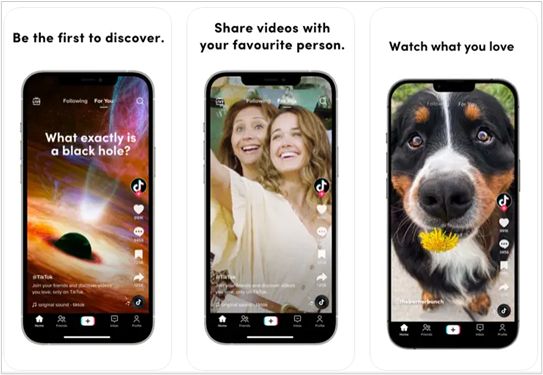

Section 1.5

# Social Media

**Please note:** You may not be allowed to use social media depending on your parole requirements. However, even if you don't use social media yourself, you'll likely hear people using social media terminology in your daily life, so this section may still be useful to you.

---

**Pre-requisites:**

Understanding this section requires some knowledge of the internet and apps. It's a good idea to read the sections listed below before reading this section. Click the links (the blue text) below to go to the prerequisite sections, or use the sidebar on the left.

- [2.1 The Internet](/course/2-apps-and-internet/2.1-the-internet.html)
- [2.2 Websites](/course/2-apps-and-internet/2.2-websites.html)
- [2.4 Apps](/course/2-apps-and-internet/2.4-apps.html)

## What is Social Media?

<figure markdown="span">
    { width="100%" }
</figure>
Image source: `https://www.searchenginejournal.com/top-reasons-why-you-need-social-media-manager/273333/`

A platform that allows users to create their own content and share it with other people is considered social media. Social media includes a wide range of apps and websites. It can be used for socializing, but also for entertainment, education, marketing, and many other pursuits.

## Terminology

There is a lot of terminology specific to social media. Many of these words you are likely familiar with, but they can mean different things in the world of social media.

`Platform:` Social media websites and apps are collectively called social media platforms.
Example sentence: “Facebook is my favorite social media platform.”

`Post:` To post something to social media means to share it on the platform for other people to see. The thing you have shared is also called a post.
Example sentences: “Is this photo good enough to post on social media?”
“I deleted all my posts with my ex since we aren’t together anymore.”

`Content:` A user’s content is a catch-all term for the photos, videos, audio, and text that they share on social media.
Example sentence: “The content that this artist posts is so creative.”

`Profile:` On almost any social media platform, you will create a ‘profile’ which is a page of information that represents you, like your name and photo. This is an online representation of who you are. It is best to avoid sharing a lot of personal information about yourself, especially if your profile is publicly available for anyone to see. You can leave optional sections blank, such as your birthday. You can also use a photo that isn’t your real face, such as a photo of your pet.
Example sentence: “I didn’t put my last name in my profile because I don’t want strangers to be able to see it.”

`Bio:` Most social media platforms have a ‘bio’ profile section where users can write a brief description of themselves. This could include their name, interests, a quote they like, links to other websites, or anything else they choose to include.
Example sentence: “This person is probably in university because it says UBC in their bio.”

`Follower/to follow:` ‘Following’ another user means clicking the ‘follow’ button on their profile. When you do this, the content that they post will be regularly shown to you.
Example sentence: “I started using social media very recently, so I don’t have very many followers.”
“I follow all my favorite celebrities but none of them have followed me back.”

`Subscriber/to subscribe:` On some platforms, the words ‘subscriber’ and ‘to subscribe’ are used in place of ‘follower’ and ‘to follow.’ They also mean a similar thing. When you subscribe to an account, you will be shown content that they post.
Example sentences: “This person said something controversial so they’re losing a lot of subscribers.”
“If you like my videos, you should subscribe to see more of them!”

`Like:` To like a post means to click the ‘like’ button on the post to show that you feel positively about it. Often this button is a heart icon or a thumbs up icon. The ‘like’ feature is available on most social media platforms. The number of likes a post has gotten refers to the number of people who have pressed the like button.
Example sentences: “I’m so embarrassed because I was looking through John’s old posts and accidentally liked a photo from three years ago - now he might think I'm obsessed with him!"
“This photo didn’t get a lot of likes but I don’t care because I think it’s a great one”

`Feed:` A feed is a stream of images, text, links, or whatever content is used on a particular platform. It is generally personalized by an algorithm (a sequence of steps executed by a computer) based on which accounts you follow or what content you have interacted with. Every time you open the app or website, your feed will be updated with new content to look at.
Example sentence: “Your Facebook feed looks nothing like mine. Yours is full of cooking videos, and mine is all photos of cats. We must follow very different people.”

`Livestream:` A livestream is a live video of a user that other users can watch, like live TV but on social media. Not all social media platforms have this feature, but many of the video-based ones do.
Example sentence: “My favourite singer is having a livestream tonight to preview their new album.”

`Meme:` A meme is a photo or video, sometimes with text over top, that is funny and is spread to many people over the internet. Memes are not exclusive to social media, but social media is often how they are spread.
Example sentence: “You should follow this account – they post the best memes.”

??? extra-info "See some examples of memes"

    <figure markdown="span">
        { width="100%" }
    </figure>
    Image source: `https://twitter.com/philsadelphia/status/1523354810119979009`
    <figure markdown="span">
        { width="100%" }
    </figure>
    Image source: `https://www.care.com/c/inspiring-single-mom-memes/`
    <figure markdown="span">
        { width="100%" }
    </figure>
    Image source: `https://cheezburger.com/5072133/30-priceless-memes-we-can-all-relate-too`

## Examples of Social Media Apps/Websites:

Below is a list of some of the most popular social media platforms. You don’t need to know the details of every single platform. This is just to give you an idea of what is available.

### Facebook

<figure markdown="span">
    { width="100%" }
</figure>
Image source: `https://apps.apple.com/ca/app/facebook/id284882215`

Facebook is a website/app that allows you to connect socially with friends and family. You can post on your “story” about what you are up to, or any questions that you have for your community. You can message your friends and also make group chats with more than one person; this also includes audio or video calls. Facebook has other features such as marketplace (a place to post items for sale/ purchase items), events (you can look up what is happening in town or host your own event with friends), news and much more.

### Instagram

<figure markdown="span">
    { width="100%" }
</figure>
Image source: `https://apps.apple.com/ca/app/instagram/id389801252`

Instagram is an app for sharing photos and videos. You can follow friends, family, celebrities, companies, famous pets, and any other accounts you choose. This allows you to personalize the content you’ll be shown. You can also share your own photos and videos for others to see. You can have private conversations with others over text or video.

### YouTube

<figure markdown="span">
    { width="100%" }
</figure>
Image source: `https://apps.apple.com/ca/app/youtube-watch-listen-stream/id544007664`

YouTube is a platform for watching and sharing videos. This includes music videos, educational content, vlogs (video blogs), movie trailers, and much more. Almost any video you see on a website is a YouTube video. YouTube is often used more for entertainment or information-seeking purposes than for social interaction, but it is still considered to be social media.

### TikTok

<figure markdown="span">
    { width="100%" }
</figure>
Image source: `https://apps.apple.com/ca/app/tiktok/id835599320?platform=iphone`

TikTok is also a video-based platform, but for shorter videos. TikTok is known for having fast-paced trends, and providing users with very personalized content. You can post your own videos on TikTok and watch videos posted by others.

## Direct Messaging and Video Chatting Through Social Media:

Many social media platforms include a feature for users to have private, text-based conversations. This is similar to texting but is called direct messaging, or DMing. Some social media platforms also have a video chatting or video calling feature where users can see and hear each other in real time.

## Tips for using social media:

- **Be careful of what you post.** Things you put on the internet can stay there forever, even if you delete them! Don’t post personal information like your address, and don’t post things you wouldn’t want employers to see.
- **Don’t believe everything you read on social media.** Anyone can post their opinions without sources to back them up. If you would like to know if something you’ve read is true, consult a reliable source. The section [2.5 Reputable Sources](/course/2-apps-and-internet/2.5-reputable-sources.html) has more information about how to identify reliable sources.
- **Be aware of your privacy settings.** Most social media platforms allow you to control who sees your posts. For instance, on Instagram, you can make your account private so that only the people you choose will see your posts
